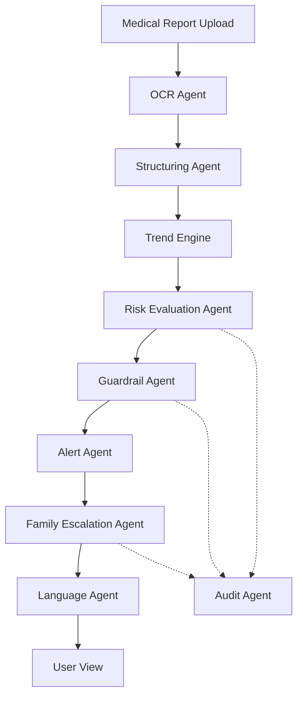

# Carevia

**A Compliance-First Multi-Agent Healthcare Intelligence System for Medical Report Understanding, Risk Escalation, and Family-Aware Care.**

Carevia is a domain-specialized healthcare AI system built for **ET Gen AI Hackathon 2026 — Problem Statement 5: Domain-Specialized AI Agents with Compliance Guardrails**.

It helps users and families securely upload medical reports, extract structured health data, explain results in simple language, detect concerning trends, classify risk, trigger safe alerts, escalate critical findings to caregivers, and maintain a full audit trail of every important AI/system decision.

Unlike generic “upload PDF and summarize” tools, Carevia is designed as a **multi-agent healthcare workflow system** with **strict medical safety guardrails**, **auditable reasoning**, **family-aware escalation**, and **edge-case handling for uncertain or low-confidence inputs**.

---

## 🏛 Architecture Overview

Carevia operates through a coordinated sequence of specialized agents to ensure clinical safety and data integrity.

### 🧩 Agent Flow Diagram


---

## 🚀 Problem Statement Alignment

**Hackathon Problem Chosen:**
**5. Domain-Specialized AI Agents with Compliance Guardrails**

Carevia directly addresses the core requirements for domain-specific AI agents:
- **Workload Execution:** Automates the complete lifecycle of medical report analysis.
- **Edge-Case Handling:** Specific logic for low-confidence OCR, missing reference ranges, and context-sensitive severity.
- **Guardrails:** A dedicated Guardrail Agent filters and transforms AI responses to prevent unauthorized medical advice.
- **Auditability:** Every decision—from trend calculation to caregiver escalation—is logged for transparency.

---

## 🩺 The Problem

Medical reports are often difficult for ordinary people to understand. Patients and caregivers struggle with:
- **Medical Jargon:** Interpreting complex values without a medical background.
- **Data Fragmentation:** Reports spread across physical copies, PDFs, and emails.
- **Lack of Continuity:** No clear visibility into how health markers change over time.
- **Delayed Intervention:** Critical findings in elderly family members may go unnoticed by caregivers.
- **Unregulated AI Risks:** Generic AI tools often hallucinate diagnoses or give unsafe medical advice.

---

## 🛠 Our Solution: The Multi-Agent Workflow

Most "AI" tools simply summarize PDFs. **Carevia coordinates agents to build a trustworthy intelligence pipeline.**

### 🤖 Agent Directory & Responsibilities

| Agent | Responsibility | Key Feature |
| :--- | :--- | :--- |
| **OCR Agent** | Text extraction from images/PDFs | Confidence scores for blurry images |
| **Structuring Agent** | Normalizes raw text to Medical JSON | Source-of-truth generation |
| **Trend Engine** | Deterministic historical comparison | Hallucination-free math |
| **Risk Evaluation Agent** | Contextual urgency classification | Age & profile-aware risk levels |
| **Guardrail Agent** | Safety & Compliance enforcement | Strips diagnostic/prescription language |
| **Alert Agent** | Actionable notification generation | Consolidates alerts to prevent fatigue |
| **Family Escalation Agent** | Caregiver-aware notification | Automatic emergency notification |
| **Language Agent** | Regional accessibility (Marathi, Hindi, etc.) | Simplified local terminology |
| **Audit Agent** | Decision logging & transparency | Full reasoning trail of system actions |

---

## 🛡 Compliance and Guardrails

Carevia is built with a **Safety-First** philosophy.

### Non-Negotiable Boundaries
- **No Diagnosis:** We explain values, we do not name diseases.
- **No Prescriptions:** We NEVER recommend drugs or dosages.
- **No Treatment Plans:** We do not suggest therapies.
- **No Confidence Hallucination:** If OCR quality is low, we explicitly state uncertainty rather than guessing.

### The Guardrail Agent in Action
*   **Input:** "Your high sugar level indicates you have Diabetes Type 2."
*   **Guardrail Filtered Output:** "Your blood glucose level is above the normal range. We recommend discussing this trend with your doctor."

---

## 🏗 Edge-Case Handling

Proper handling of uncertainty is what makes an agent "intelligent" rather than just "automated":
- **Low OCR Confidence:** Down-levels the severity and requests a clearer re-upload.
- **Missing Reference Ranges:** Prevents binary "Normal/Abnormal" classifications when data is incomplete.
- **Contextual Severity:** An abnormal value for an adult maybe be critical for an elderly dependent; our agents adapt accordingly.

---

## 🔍 Auditability & Transparency

Unlike black-box LLMs, Carevia exposes its reasoning trail for every report:
- **[Audit Log]** *HbA1c increased by 31% from Jan 2025.*
- **[Audit Log]** *Risk classified as High based on trend + abnormal status.*
- **[Audit Log]** *Guardrail Agent blocked diagnostic phrasing in explanation.*
- **[Audit Log]** *Escalation triggered: Caregiver (Suhani) notified via high-priority alert.*

---

## 💻 Tech Stack

- **Frontend:** React Native (Expo) - Premium Medical UI.
- **Backend:** Supabase (Auth, Postgres, Edge Functions, RLS).
- **AI Core:** Gemini 2.0 Multimodal (OCR, Analysis, Localization).
- **Persistence:** Secure Postgres storage with Row Level Security.

---

## 📁 Project Structure

```text
Carevia/
├── src/
│   ├── assets/       # Icons, Logos & Branding
│   ├── components/   # Modular UI Library
│   ├── context/      # App & Navigation State
│   ├── lib/          # Native Helpers (Supabase, API)
│   ├── screens/      # Feature-specific Views
│   └── ...
├── supabase/
│   ├── functions/    # Agentic Edge Functions (process-report, ai-chat)
│   └── schema.sql    # Health Data & Audit Schema
├── App.tsx
├── app.json
└── README.md
```

---

## ⚙️ Setup & Installation

### Prerequisites
- Node.js 20+
- Android Studio / Xcode
- Supabase CLI

### Installation
```bash
git clone https://github.com/suhani392/Carevia.git
cd Carevia
npm install
```

### Run Locally
```bash
npx expo run:android
# Then start the bundler
npx expo start --dev-client
```

---

## 🏆 Why Carevia Can Win

Carevia stands out because it doesn't just "use AI"—it **manages AI**. By implementing a multi-agent system that prioritizes **safety, auditability, and family care**, we solve the real-world obstacles (trust and compliance) that prevent AI from being used safely in healthcare today.
