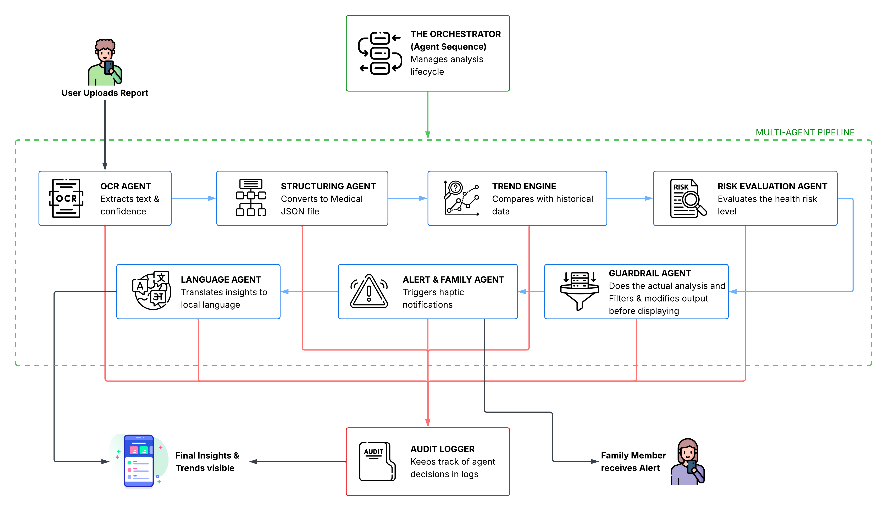

# Carevia

**Carevia — AI-powered health report analysis and insights platform**

Carevia is a domain-specialized healthcare AI system designed to transform complex medical reports into actionable, easy-to-understand insights for families. Carevia prioritizes clinical safety, data integrity, and real-time family-aware care.

---

## 🎥 Demo

[Watch Demo Video](#)  
*(Add your video link here)*

---

## 📦 APK Download

[Download APK](#)  
*(Add your APK link here)*

---

## 📸 Screenshots

*(Add screenshots here — Upload, Insights, Trends, Alerts UI)*

---

## 🩺 Problem Statement
**The Problem:**
Medical reports are often a source of anxiety rather than clarity. Patients and their families face several critical challenges:
- **Medical Jargon:** Interpreting complex values (like HbA1c or Triglycerides) without a medical background is nearly impossible.
- **Data Fragmentation:** Health history is scattered across physical papers, PDFs, and emails.
- **Lack of Continuity:** There is no easy way to track how health markers change over time.
- **Delayed Intervention:** Critical findings in elderly family members may go unnoticed by caregivers.
- **AI Hallucinations:** Generic AI tools often provide unsafe medical advice or incorrect diagnoses.

---

## 💡 What Makes Carevia Unique?

- **Multi-Agent Architecture:** Not a single LLM call, but a coordinated pipeline of specialized agents.
- **Deterministic Trend Engine:** Uses mathematical calculations instead of AI guesses.
- **Family-Aware Alerts:** Real-time escalation system for critical health risks.
- **Zero-Diagnosis Guardrails:** Prevents unsafe medical advice.
- **Full Audit Trail:** Every decision is logged for transparency and explainability.

---

## 🏆 Hackathon Evaluation Focus
*How Carevia meets the ET Gen AI Hackathon criteria:*

| Criterion | Implementation in Carevia |
| :--- | :--- |
| **Domain Expertise Depth** | Uses a `Structuring Agent` to normalize raw OCR text into **standardized Medical JSON** (biomarkers, units, and ranges) rather than just summarizing text. |
| **Compliance & Guardrails** | A dedicated `Guardrail Agent` filters every AI response. It uses **Zero-Diagnosis logic** to strip any names of diseases or drug prescriptions, ensuring safety. |
| **Edge-Case Handling** | The `OCR Agent` calculates **Confidence Scores**; if a report is blurry, it triggers a "Safety Re-upload" request instead of guessing. Handles missing reference ranges gracefully. |
| **Full Task Completion** | A complete **End-to-End Pipeline**: Upload → OCR → Structuring → Trend Analysis → Risk Evaluation → Family Alerting → Localization. |
| **Auditability** | Every single agent decision (Logic, Reasoning, and Confidence) is stored in the `audit_logs` table, providing a **full transparent reasoning trail**. |

---

## ✨ Solution: The Multi-Agent Pipeline
Carevia coordinates a **Multi-Agent AI Pipeline** to build a trustworthy and proactive healthcare intelligence system.

- **AI-Powered Automation:** Automates the complete lifecycle of health data.
- **Family-Aware Escalation:** Automatically notifies caregivers when high-risk findings are detected.
- **Safety First:** Strict guardrails prevent unauthorized medical advice.
- **Auditability:** Every system decision is logged for transparency.

---

## 🏗 Architecture Diagram

  
*(Add your architecture diagram here)*

---

## 🔄 How It Works (End-to-End Flow)

Carevia operates through a coordinated sequence of specialized agents:

1. **User uploads a report** (PDF/Image)
2. **OCR Agent** extracts text and generates a confidence score  
3. **Structuring Agent** converts raw text into standardized Medical JSON  
4. **Trend Engine** compares biomarkers with historical data  
5. **Risk Agent** evaluates urgency based on user profile (age, history)  
6. **Guardrail Agent** ensures safe, non-diagnostic output  
7. **Alert/Family Agent** triggers notifications if risk is critical  
8. **Language Agent** translates insights into regional languages  
9. **Audit Logger** records every step for transparency  

---

## 🚀 Key Features

- 📑 **Report Upload & OCR:** High-confidence text extraction with blurry-image detection.
- 📊 **Smart Structuring:** Converts raw text into structured Medical JSON for precise analysis.
- 📈 **Trend Analysis:** Deterministic tracking of biomarkers over time with visual SVG graphs.
- ⚠️ **Context-Aware Risk Evaluation:** Categorizes risk (Normal, Moderate, Critical) based on age and health profile.
- 🚨 **Premium Family Alerts:** Real-time haptic notifications for caregivers during emergencies.
- 🛡️ **Compliance Guardrails:** Ensures clinical safety by stripping diagnostic/prescription language.
- 🤖 **Interactive AI Assistant:** Chat with your structured health data for personalized context.
- 🌍 **Language Localization:** Regional language support (Hindi, Marathi, etc.) for accessibility.

---

## 🛡️ Compliance & Safety Guardrails
Carevia is built with a **Safety-First** philosophy.
- **No Diagnosis:** We explain medical values; we do not name diseases.
- **No Prescriptions:** We NEVER recommend drugs or dosages.
- **No Treatment Plans:** We do not suggest therapies.
- **Auditability:** Every decision—from trend calculation to caregiver escalation—is logged in the `audit_logs` table.

---

## 📊 Impact Model

- ⏱ **Time Saved:** Reduces report understanding time from ~30 minutes to under 5 minutes  
- 💰 **Cost Savings:** Avoids unnecessary doctor consultations (~₹500 per case)  
- 👨‍👩‍👧 **Family Safety:** Enables real-time caregiver intervention for critical cases  
- 📈 **Scalability:** Cloud-based system capable of supporting thousands of users  

---

## 🧠 Challenges Faced
- **Context-Aware Risk Logic:** Distinguishing "Critical" from "High" based on age and pre-existing conditions.
- **Deterministic Trends:** Ensuring graphs are calculated with math (SVG), not AI "guesses."
- **Real-Time Sync:** Implementing low-latency global listeners for family emergency alerts.

---

## 🛠 Tech Stack
- **Frontend:** React Native (Expo), React Native SVG, Reanimated.
- **Backend:** Supabase (Auth, Postgres, Real-time, Edge Functions).
- **AI Core:** Google Gemini 2.0 Multimodal (Powering the Agent Pipeline).

---

## 📁 Project Structure
```text
Carevia/
├── src/
│   ├── components/   # Modular UI Components (Navbar, Tour, Modals)
│   ├── context/      # State Management (Auth, Theme, Navigation, Tour)
│   ├── lib/          # Helper libraries (Supabase Client, Avatars)
│   └── screens/      # Feature Screens (Home, AI-Bot, ScanReport, Family)
├── supabase/
│   ├── functions/    # AI Agent Edge Functions (Multi-Agent Orchestrator)
│   └── schema.sql    # Database schema including Audit Logs and Trends
├── App.tsx           # Main Application entry and Global Alert Listener
└── package.json      # Project dependencies
```

---

## ⚙️ Setup Instructions
### 1. Clone the Repository
```bash
git clone https://github.com/suhani392/Carevia.git
cd Carevia
```

### 2. Install Dependencies
```bash
npm install
```

### 3. Run the Application
```bash
npx expo start
```
OR
```bash
npx expo start --tunnel
```

*Use the Expo Go app or an emulator to view the project.*

---

## 📖 Usage Guide
1.  **Step 1:** Run `npm install` and `npx expo start`.
2.  **Step 2:** Follow the interactive tour on first login.
3.  **Step 3:** Tap **Scan** to upload a medical report.
4.  **Step 4:** Watch the real-time status bar as agents coordinate.
5.  **Step 5:** View your trends and family alerts on the dashboard.

---

## ⚖️ License & Copyright
**Copyright © 2026 Spectra.**
This project is for personal, educational, and competition purposes. The multi-agent healthcare workflow is proprietary.

---

## ⚠️ Medical Disclaimer
**Carevia is an AI-powered informational tool and NOT a medical device.** Insights are for educational purposes only. Always consult a qualified healthcare professional.
